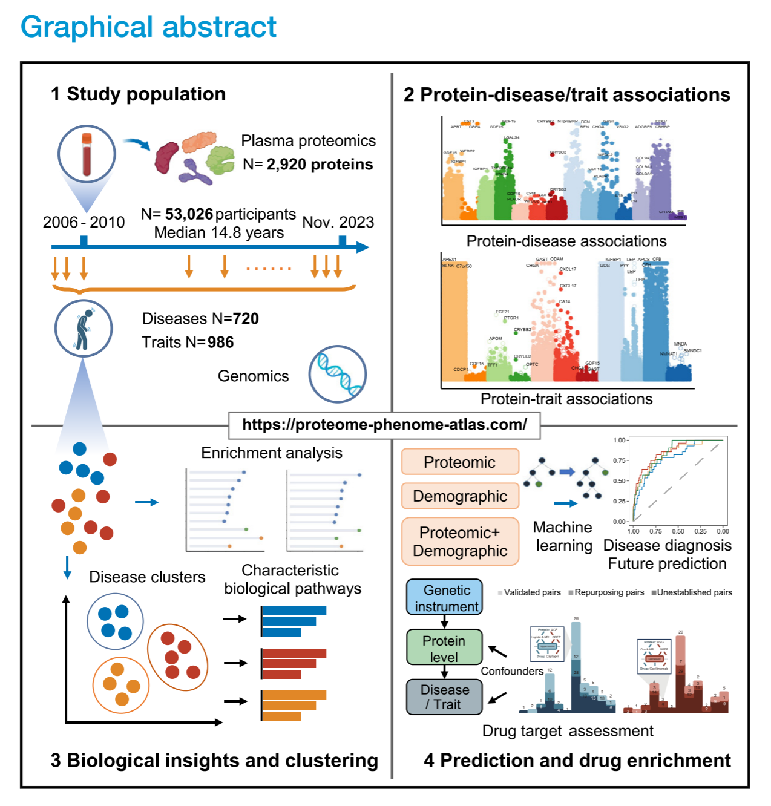
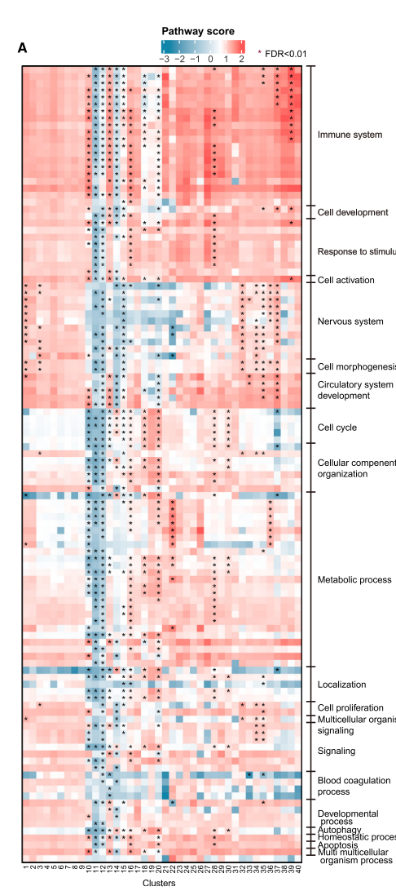

# 文献解读：Atlas of the plasma proteome in health and disease in 53026 adults

今天解读的文献来自2025年《Cell》杂志，主要研究了UKB人群数据库中的蛋白质组学与多种疾病的关联网络。随着测序技术的通量不断提升，结合大规模人群数据库，这类组学研究与多种疾病和表型的图谱构建变得越来越可行。这些研究有助于我们从更宏观的视角探索疾病的发生机制，以及其与流行病学和遗传因素之间的关系。

[TOC]

**文献地址:** https://www.cell.com/cell/fulltext/S0092-8674(24)01268-6?_returnURL=https%3A%2F%2Flinkinghub.elsevier.com%2Fretrieve%2Fpii%2FS0092867424012686%3Fshowall%3Dtrue

**文献代码：** https://github.com/jasonHKU0907/proteome-phenome-atlas

## 文献主要内容及创新性

1. 以往 proteomics 研究多局限于少数疾病或小规模人群，而该研究覆盖 406 种既往疾病、660 种新发疾病、986 种健康相关性状，总关联对数超过 70 万，规模远超既有工作。

2. 全面实现了从 相关 → 因果 → 临床应用 → 药物开发 的完整 pipeline

---

## 文章结构

1. **Introduction**
   强调血浆蛋白是连接基因与疾病的关键，但缺乏系统性全景图谱。

2. **Population & Data**
   使用 UK Biobank 53,026 人的血浆蛋白数据（2,920 蛋白），结合 406 种既往疾病、660 种新发疾病和 986 种健康性状。

3. **Protein–Disease Associations**
   发现 168,100 个蛋白–疾病关联，验证已知并发现大量新关系，部分蛋白在不同疾病阶段作用相反。

4. **Protein–Trait Associations & Pleiotropy**
   发现 55 万余个蛋白–性状关联，揭示多效性蛋白（如 GDF15、TNF 家族）在多种疾病与性状中普遍作用。

5. **Functional Enrichment & Disease Clustering**
   蛋白相关通路主要集中在免疫、代谢和神经功能；基于蛋白特征将 660 种疾病聚为 40 个簇，重新定义疾病边界。

6. **Prediction & Diagnosis**
   蛋白模型在 92 种疾病预测和 124 种疾病诊断中表现出高精度（AUC >0.8），优于单纯人口学模型。

7. **Causal Inference (pQTL + GWAS → MR)**
   通过 MR 分析确定 474 个因果蛋白，明确其在疾病发生中的作用而非仅仅是伴随变化。

8. **Drug Target Discovery & Repositioning**
   结合药物数据库，验证已知靶点，提出 37 个药物再利用机会和 26 个安全的新靶点。

9. **Discussion & Future Directions**
   提出该图谱为精准医学奠基，但需要在多种族和组织特异的蛋白质组中进一步扩展。

---

## 主要实验内容

1. **血浆蛋白测定与协变量收集**

* 数据：UK Biobank 基线血样，Olink 4 大面板；最终纳入 **2,920** 蛋白（NPX 值），配套协变量（年龄、性别、族裔、TDI、BMI、吸烟、采血季节、空腹时间、样本年龄等）。&#x20;
* 方案：>50% 缺失的蛋白剔除；缺失协变量用中位数填补。
* 方法：Olink 官方流程与以往实践获得 NPX；后续统计在 Python/R 环境执行。&#x20;

2. **疾病终点构建（prevalent/incident）**

* 数据：UKB 住院记录到 **2023-11**；阈值：每个终点病例 **≥100**。&#x20;
* 方案：incident 以“事件时间”处理；基线已患该病者不进入该病的 incident 分析。&#x20;
* 方法：部分终点参考 FinnGen endpoint 规则与 QC。

3. **健康相关性状处理（traits）**

* 数据：UKB 基线体测/问卷/化验等；最终 **453 连续｜331 有序分类｜202 二元**。&#x20;
* 方案：用 **PEACOK** 解析映射并定型；样本量阈值与二元性状最小案例数要求。
* 方法：R 包 **PEACOK**（PHESANT 升级版）生成三类变量供回归建模。

4. **蛋白—既往疾病关联（横断面）**

* 数据：2,920 蛋白 × 406 既往病。
* 方案：统一协变量校正；Bonferroni：p<0.05/(2,920\*406)。&#x20;
* 方法：Python **statsmodels** 逻辑回归，输出 OR/CI。

5. **蛋白—新发疾病关联（纵向）**

* 数据：2,920 蛋白 × 660 新发病。
* 方案：Cox 生存模型；Bonferroni：p<0.05/(2,920\*660)。
* 方法：Python **lifelines**（CoxFitter），输出 HR/CI。

6. **蛋白—性状关联**

* 数据：\~1,000 traits（三类）。
* 方案：按变量类型建模；多重校正阈值 p<1.71×10⁻⁸（≈0.05/(2,920\*1000)）。
* 方法：R **MASS** 包：线性（连续）、逻辑（二元）、**polr**（有序）。

7. **稳健性与分层分析**

* 数据/方案：严格对照定义 + 共病（14 章）作协变量；另加 age²、age×sex、PCs 等；性别/年龄分层使用相同模型与严格阈值。&#x20;
* 方法：同主分析的回归框架与 Bonferroni 分层阈值。

8. **通路富集（按疾病/章节）**

* 数据：每病显著蛋白（无显著时取前30名）。
* 方案：GO BP 与 Reactome；多检验 **BH-FDR<0.05**。
* 方法：R **clusterProfiler** 与 **ReactomePA**。

9. **疾病聚类（蛋白图谱驱动）**

* 数据：660 新发病 × 2,920 蛋白的 HR 矩阵（预归一化）。
* 方案：层次聚类，Ward’s linkage；输出疾病簇（Table S6）。
* 方法：Python **SciPy hierarchy**。

10. **簇级别 GSEA 与跨簇比较**

* 数据：按 Cox Z 值为每病排序后做 GSEA；保留在任一疾病显著的前10条通路。
* 方案：簇内取均值并 **Wilcoxon** 与其余簇比较；BH-FDR 调整。
* 方法：R **clusterProfiler**（MSigDB C5 GO BP）；Wilcoxon 秩和检验。

11. **多病共存（multimorbidity）序数回归**

* 数据：按每个疾病簇统计个体在随访期内的“该簇 incident 病数”。
* 方案：以该序数作为因变量，分析与蛋白的关联；Bonferroni：0.05/(2,920\*40)。
* 方法：序数回归，协变量同主分析。

12. **机器学习：诊断与预测模型（LightGBM）**

* 数据：诊断 406 病｜预测 660 病；特征为信息增益排名 **前30** 蛋白；对照建立人口学/整合模型。
* 方案：**嵌套 leave-one-region-out**（10 地理中心）外部测试；训练内 **5 折** 网格寻优；自助法 1,000 次评估 AUC/敏感度等；DeLong 比较。&#x20;
* 方法：Python **LightGBM** + **scikit-learn**。

13. **因果推断：pQTL/GWAS → 双样本 MR**

* 数据：蛋白 GWAS（cis≤1Mb 与 trans，p<5×10⁻⁸）；疾病 GWAS（优先 FinnGen DF9，其余用 UKB 英裔子集 **GCTA fastGWA-GLMM** 生成）；LD 剔除 r²<0.01；去除“一变异关联>5 蛋白”与 F<10 的工具。
* 方案：**双向 MR**（蛋白→疾病 / 疾病→蛋白），以 FDR<0.05 判定“因果”与“后果”关系；单工具用 **Wald ratio**，多工具用 **IVW**。
* 方法：R **TwoSampleMR**；并在网站提供完整结果浏览。&#x20;

14. **结果资源与可复用性**

* 数据/方法：全部显著关联、模型表现、疾病簇/通路等汇总到在线 **proteome-phenome-atlas** 供检索与下载。

> 一句话总览：**先测蛋白→建疾病/性状终点→做蛋白×疾病/性状全图关联与稳健性→做通路与疾病聚类/多病共存→建 ML 诊断预测模型→再用 pQTL/GWAS 做双向 MR 区分因果与后果→上线数据门户**。

## 个人思考

### **问题：** 关联蛋白，表型疾病，并通过pQTL和MR确定因果关系的技术路线早就已经有了，但是为什么之前没有人做大规模的研究呢？

**推测：** 虽然GWAS(2005~2007)和MR(2003)是早有的技术，但是核心推动力就是 UK Biobank 新增并开放了大规模的蛋白组数据（用的是 Olink 平台）(2020年启动,2023年后开放使用)。以前大家没有这个数据基础，即使有想法也没法做“全景式”的工作。

### **问题：** figure 4 A的热图是如何实现的呢？

**答：** Figure 4A 是一张“**疾病簇 × 通路富集得分**”的热图，画法概括如下（按分析流水线顺序）：

1. **先做疾病聚类，得到 40 个疾病簇**
   用 660 个 incident 疾病对 2,920 蛋白的 **Cox HR** 组成矩阵（先归一化），以 **Ward’s linkage 的层次聚类**在 SciPy 里分簇；这些簇就是后续热图的列分组基础。&#x20;

2. **逐病做 GSEA，得到每个病的通路分数（NES）**
   把每个疾病的蛋白按 **Cox Z 值**排序，送入 **clusterProfiler** 做 **GO Biological Process（MSigDB C5, v2023.2.Hs）** 的 **GSEA**，得到该病的**标准化通路富集分数**（NES）。仅保留在任一疾病里经 FDR 校正显著的**前 10 条通路**进入后续。

3. **聚类层面做通路差异与汇总**
   对每一条通路，比较“某一疾病簇内的疾病 NES”与“其他所有簇疾病 NES”，用 **Wilcoxon 秩和检验**并做 **BH-FDR** 校正；每个簇保留**差异最显著的前 5 条通路**用于展示。

4. **绘制热图**
   对每个“疾病簇 × 通路”，取该簇内所有疾病 NES 的**均值**作为热图颜色值；在显著差异的通路格上标 **星号**（FDR<0.01）。图注即“颜色=簇内疾病的通路分数均值；星号=与其他簇相比差异显著”。&#x20;

> 一句话：先用 HR 矩阵把疾病分成 40 簇→逐病做基于 Cox Z 值排序的 **GSEA** 得到 NES→簇内求均值画热图，并用 **Wilcoxon+FDR** 标出各簇**最具代表性**的前 5 条差异通路。 &#x20;

### **问题：** 什么是protein-based model,什么是demographic model呢？
**答：**

* **Protein-based model**：只用蛋白特征做输入；每个疾病从 2,920 个蛋白里用 LightGBM 的**信息增益**选出**前 30 个最重要蛋白**作为特征，再用 LightGBM 训练分类器。
* **Demographic model**：只用**临床-人口学变量**做输入：年龄、性别、种族（ethnicity）、TDI、BMI、收缩压、吸烟状态、饮酒状态；同样用 LightGBM 训练。

**共同点（构建方式）**

* **算法**：LightGBM；分别为每个疾病建立**预测模型**（incident，n=660）和**诊断模型**（prevalent，n=406）。
* **验证**：**嵌套的 leave-one-region-out** 交叉验证（按 10 个 UKB 招募地区分折）；内层 5 折调参；外层独立测试；1,000 次自助法评估 AUC/准确率等。
* **比较**：用 **DeLong 检验**比较 **protein-based vs demographic** 的 AUC；另比较 **demographic vs 集成模型（蛋白+人口学）** 以评估蛋白的增益。

**一句话**：蛋白模型=“前30蛋白 + LightGBM”，人口学模型=“8个临床-人口学变量 + LightGBM”，两者在同一套严格的嵌套交叉验证框架下对比，论文报告蛋白模型在 361/660 个疾病的预测上显著优于人口学模型（DeLong 检验）。

### **问题：** 机器学习的每个蛋白的重要性如何获取呢？
**回答**：

在文章中，机器学习算法主要使用 **LightGBM** 来评估蛋白的重要性，具体步骤如下：

* **特征选择**：对于每个疾病（无论是预测新发疾病还是诊断既往疾病），作者通过 **LightGBM** 模型选出 **前 30 个最重要的蛋白**作为特征。

  * 这些蛋白的重要性是通过 **信息增益（information gain）** 来衡量的，**信息增益越高的蛋白对模型的预测贡献越大**。
* **模型训练**：

  * 使用 **蛋白特征**（2,920 个蛋白）和 **人口学特征**（如年龄、性别等）分别建立疾病预测模型和诊断模型。
  * 通过 **5 折交叉验证**优化 LightGBM 模型并评估性能，使用 **AUC（曲线下面积）** 和 **准确率** 来衡量模型效果。
* **重要性输出**：

  * 通过 LightGBM 训练完成后，提取每个蛋白在模型中的 **重要性值**，并基于 **信息增益**的排名来显示哪些蛋白对预测/诊断特定疾病贡献最大。

### 这篇文献用的是PheWAS吗？
*答：* 短答：**方法学上算，但严格说是“泛化版 PheWAS”。**

* 经典 **PheWAS** 是“用**同一个暴露**（常见是基因变异/PRS）去**扫一整套表型**”。
* 本文对**每一个蛋白**分别在**大量表型**上做关联：

  * 对既往病（prevalent）做 **logistic 回归**（横断面 PheWAS），
  * 对新发病（incident）做 **Cox 回归**（纵向/生存型 PheWAS），
  * 并覆盖 406+660 个疾病终点与 \~1000 个性状。&#x20;

因此，**对“单个蛋白”的那一组分析，本质就是一场 PheWAS**；只不过论文把这套流程对 **2,920 个蛋白**“横向平铺”，做成了一个 **proteome–phenome atlas**（多暴露×多表型的全景图），超出了传统“单暴露”PheWAS 的尺度。

另外，由于蛋白水平受疾病状态/环境影响更大，作者还做了**严格敏感性分析**与 **pQTL→MR** 来区分因果/后果，这也是“蛋白版 PheWAS”与经典“基因版 PheWAS”的重要差异与补强。&#x20;

### 那么为什么文献不使用PheWAS呢？

*答：* 不叫 “PheWAS”，主要是因为这篇工作**远超“单一暴露扫全表型”的传统范式**，更像一个“多暴露×多表型”的**全景资源（atlas）**。要点如下：

* **暴露不是一个，而是整个蛋白组**：传统 PheWAS=“一个暴露（常见是SNP/PRS）→一整套表型”；本文是 **2,920 个蛋白**各自对 **406+660 个疾病和 \~1,000 个性状**做关联，相当于成千上万次“类 PheWAS”叠加，语义上更贴近“atlas”。
* **不只相关，还串起了多层分析**：除了横断面 **logistic**（prevalent）和纵向 **Cox**（incident），还做了**性状（线性/有序回归）**、**疾病聚类与通路富集**、**多病共存序数回归**、**机器学习预测/诊断（LightGBM）**、以及 **pQTL+GWAS 的 MR 因果**；这已超出“PheWAS=批量回归”的范畴。
* **表型体系与受众定位不同**：经典 PheWAS多依赖 **ICD→PheCode** 的EHR流程；本文用 UKB 的**事件终点与表型路径**、并强调**随访事件**（Cox）为主的重要性，定位为**面向全社区可查询的图谱资源**。
* **传播与产品化**：作者还上线了交互网站与整套资源包，“atlas”在期刊叙事与资源复用上更直观，也避免和“PheWAS（特指基因/EHR工作流）”混淆。

一句话：这项研究把“蛋白版 PheWAS”做成了**规模更大、层次更深、可复用的全景图谱**，所以选择用“proteome–phenome atlas”的表述更准确也更有传播力。

## 关键名词解释

### 什么是 pQTL？

- QTL（Quantitative Trait Locus）：泛指与数量性状（如身高、体重、基因表达等）显著相关的基因组位点。

- pQTL（protein quantitative trait loci）：指影响 蛋白质水平 的遗传变异（通常是 SNPs）。

- cis-pQTL：位于蛋白编码基因附近（通常 <1Mb），直接影响该基因表达或翻译后的蛋白水平。

- trans-pQTL：位于基因外远距离区域，通过调控因子、信号通路等间接影响蛋白水平。

简单理解：pQTL 就是“决定某个血浆蛋白高低的遗传位点”，类似于 eQTL（expression QTL）决定基因表达水平。

---

### Prevalent disease（患病率相关疾病 / 既往疾病）

* **定义**：指 **在基线（研究起始时，采血时）已经确诊存在的疾病**。
* **数据来源**：问卷、病历、电子健康记录里显示 **在血样采集之前** 已经诊断过。
* **分析方法**：通常用 **横断面分析**（cross-sectional，逻辑回归），比较“当时是否有病”与蛋白水平之间的关系。

举例：在 2008 年 UK Biobank 采血时，某人已经有 2 型糖尿病 → 这是 **prevalent T2D**。

---

### Incident disease（发病率相关疾病 / 新发疾病）

* **定义**：指 **在基线时没有疾病，但在随访过程中发生的新诊断**。
* **数据来源**：长期随访的电子健康记录，记录了 **采血之后** 的新发病。
* **分析方法**：用 **纵向分析**（longitudinal，Cox 回归 / time-to-event），考察蛋白水平能否预测未来发病。

举例：某人在 2008 年采血时没有糖尿病，但在 2015 年新确诊了 2 型糖尿病 → 这是 **incident T2D**。

---

### Olink

Olink：瑞典公司，开发的高通量蛋白质定量平台。

核心技术：Proximity Extension Assay (PEA)

原理：

设计两条带有 DNA barcode 的抗体探针，特异性结合同一个蛋白。

当目标蛋白存在时，两条探针相邻，DNA 序列发生延伸反应。

通过 qPCR 或 NGS 测定扩增的 DNA 信号，从而间接反映蛋白含量。

特点：

灵敏度高（fg/mL 级别）。

需要血浆体积极少（1–3 μL）。

可一次性检测数千种蛋白。

Olink Explore 3072：可以同时检测约 3,000 种蛋白，是 UKB 项目使用的主力平台。

---
### Sensitivity analysis

**敏感性分析（sensitivity analysis）**是用来检验研究结论**稳健性**的方法：在不改变核心科学问题的前提下，刻意调整关键假设、样本选择或模型设定，观察结果是否明显变化。
**常见做法**：①更严格的样本筛选（如收紧对照、排除共病或极端值、设定“缓冲期”避免反向因果）；②更换或增加协变量（如加入 age²、交互项、遗传PCs、批次/中心）；③更换统计模型与误差结构（如 logistic ↔ Firth/SAIGE、Cox ↔ 竞争风险）；④变更变量定义与多重校正策略（Winsorize、不同阈值、FDR↔Bonferroni）；⑤负对照/安慰剂与置换检验。
**例子**：主分析发现某蛋白与心梗风险 OR=1.20、p<1e-6；敏感性分析中改为严格对照+校正共病+加入 age²、age×sex、10个PCs，并排除随访前两年事件，若效应仍≈1.18–1.22、方向不变，则认为结论**稳健**；若效应消失或反转，则需谨慎解读与追因。

---
### pleiotropy

pleiotropy （名词） = 多效性 / 多效基因作用

遗传学含义

指 一个基因影响多个表型性状 的现象。

这是遗传学中一个基础概念，说明基因的作用不是“一对一”的，而是“一对多”。

在复杂疾病研究中

pleiotropy 解释了为什么同一个遗传变异可能与多种疾病或性状相关。

在 GWAS、MR（孟德尔随机化）研究里，经常要考虑 horizontal pleiotropy（水平多效性），因为它会造成因果推断的偏倚。

---